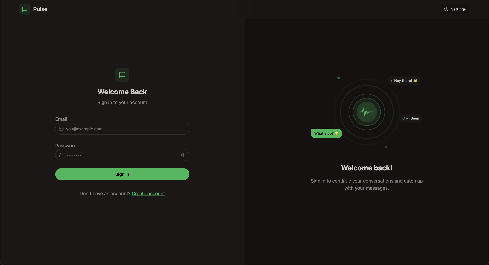
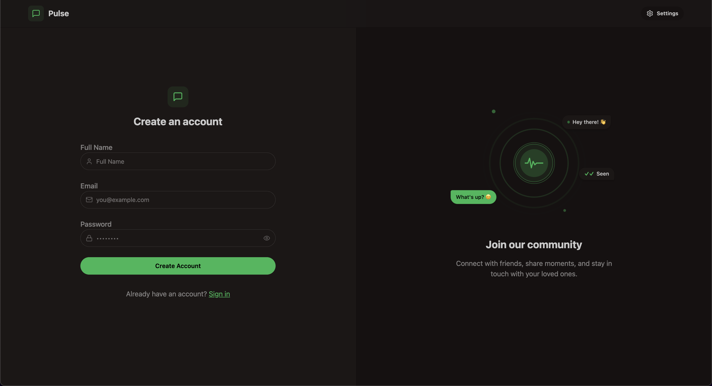
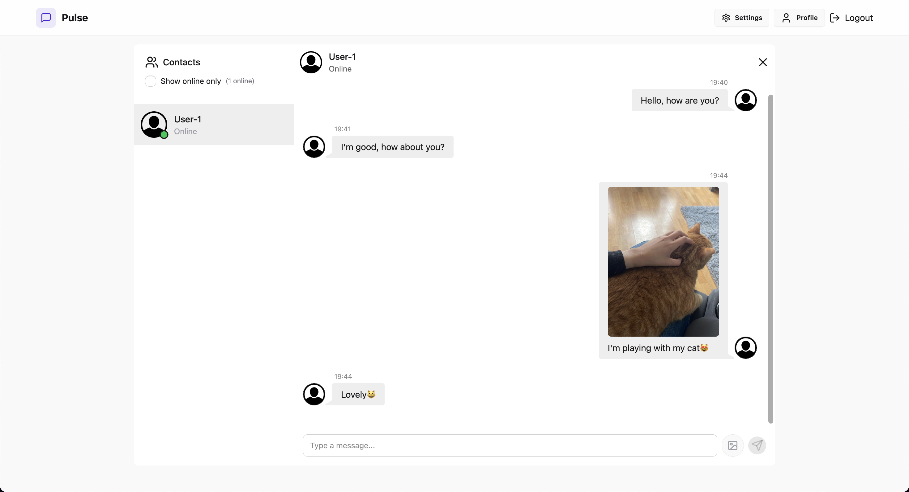
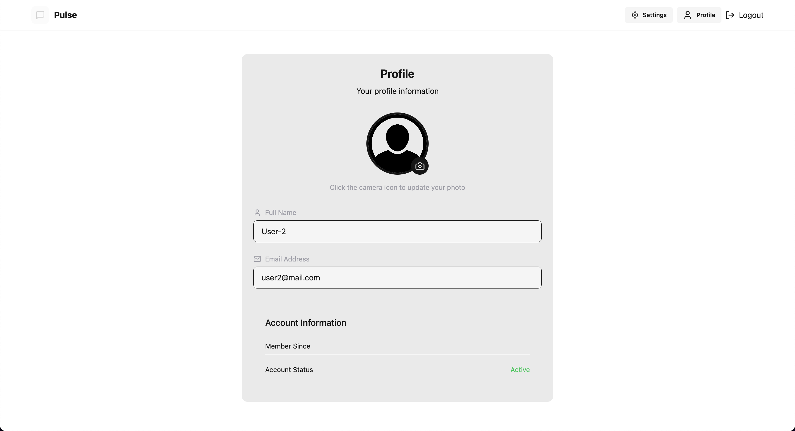
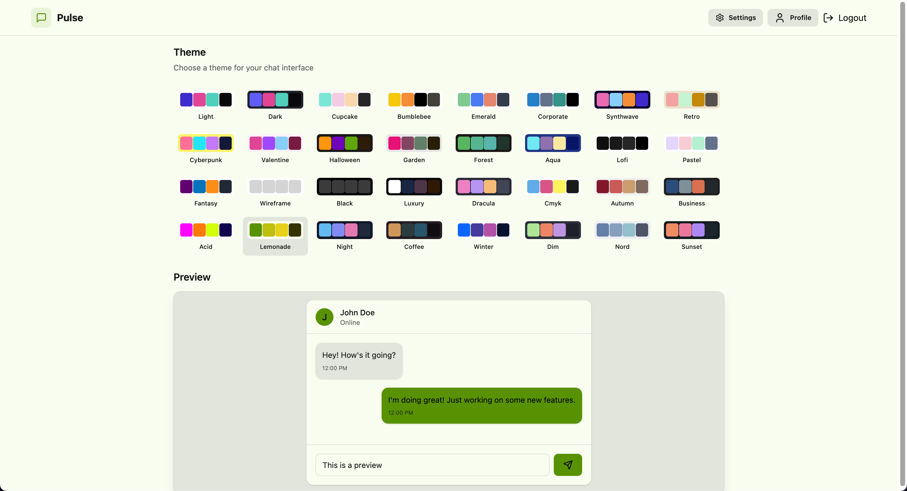

<h1 align="center">Pulse</h1>

<p align="center">
  A full-stack real-time chat application built with the MERN stack and Socket.io.
</p>

<p align="center">
  
  
  
  
</p>

---

## Overview

**Pulse** is a real-time messaging web application that lets users register, sign in, and chat with others instantly. Messages and images are delivered live over WebSockets. Users can personalise their experience with built-in DaisyUI themes and manage their profile picture via Cloudinary.

---

## Authentication

Pulse uses JWT-based authentication stored in HTTP-only cookies. Both sign-in and sign-up forms include inline icon hints and show/hide password toggle for a smooth user experience.

<p align="center">
  
</p>

<p align="center">
  
</p>

---

## Real-Time Chat

Messages are delivered instantly with Socket.io. You can see which contacts are online, send text and images (up to 5 MB), and scroll through your conversation history.

<p align="center">
  
</p>

---

## Profile Management

Users can update their display name and upload a profile picture directly from the Profile page. Pictures are stored and served through Cloudinary.

<p align="center">
  
</p>

---

## Themes

Pulse ships with 32 DaisyUI themes selectable from the Settings page. A live preview updates immediately so you can pick the look that suits you before confirming.

<p align="center">
  
</p>

---

## Getting Started

### Prerequisites

- Node.js 18+
- A [MongoDB Atlas](https://www.mongodb.com/atlas) account
- A [Cloudinary](https://cloudinary.com) account

### 1. Clone the repository

```bash
git clone https://github.com/aliemrepmk/pulse.git
cd pulse
```

### 2. Configure the backend

```bash
cd backend
cp .env.example .env
```

Open `backend/.env` and fill in your values:

```env
MONGODB_URI=your_mongodb_connection_string
JWT_SECRET=your_jwt_secret

CLOUDINARY_CLOUD_NAME=your_cloud_name
CLOUDINARY_API_KEY=your_api_key
CLOUDINARY_API_SECRET=your_api_secret
```

### 3. Configure the frontend

```bash
cd ../frontend
cp .env.example .env
```

The default values work for local development out of the box:

```env
VITE_API_BASE_URL=http://localhost:5001/api
VITE_SOCKET_URL=http://localhost:5001
```

### 4. Install dependencies

```bash
# Backend
cd backend && npm install

# Frontend
cd ../frontend && npm install
```

### 5. Run locally

```bash
# Terminal 1 — backend
cd backend && npm run dev

# Terminal 2 — frontend
cd frontend && npm run dev
```

The app will be available at `http://localhost:5173`.

---

## Project Structure

```
pulse/
├── backend/
│   ├── src/
│   │   ├── controllers/     # Route handlers
│   │   ├── lib/             # DB, Cloudinary, Socket, JWT utils
│   │   ├── middleware/      # Auth middleware
│   │   ├── models/          # Mongoose schemas
│   │   └── routes/          # Express routers
│   ├── .env.example
│   └── package.json
├── frontend/
│   ├── src/
│   │   ├── components/      # Reusable UI components
│   │   ├── pages/           # Route-level page components
│   │   ├── store/           # Zustand state stores
│   │   └── lib/             # Axios instance, utilities
│   ├── .env.example
│   └── package.json
└── assets/
    └── img/                 # Screenshots
```

---

## Security

- Passwords hashed with **bcryptjs**
- Sessions use **HTTP-only, SameSite=Strict JWT cookies**
- JWT algorithm pinned to **HS256** to prevent confusion attacks
- Image uploads validated as **base64 data URIs** before reaching Cloudinary (SSRF protection)
- Auth routes **rate-limited** to 10 requests per 15 minutes per IP
- HTTP security headers via **helmet**
- Client-side file size enforced at **5 MB** before any upload

---

## Roadmap & Features

- [x] **Core Chat functionality** (Text & Image Attachments).
- [x] **Authentication System** (JWT, Registration).
- [x] **Responsive Theme Ecosystem** (32 DaisyUI themes).
- [x] **Live User States:** Real-time visibility tracking (Online/Offline).
- [x] **"Last Seen" Tracker:** Web-socket powered exact disconnect timestamps.
- [x] **Dynamic Typing Indicators:** Live-debounced keystroke status relays.
- [x] **Message Editing:** Modify sent messages with an `(edited)` live sync.
- [x] **Read Receipts (Message Status):** 3-tier checking system (`Sent`, `Delivered`, `Read`).
- [x] **Sidebar Unread Counters:** Displaying numeric red badges `(3)` next to offline alerts.
- [x] **Delete Messages:** Local and global database message deletion endpoints.
- [ ] **Message Pagination / Infinite Scroll:** Fetching older messages incrementally to save resources.
- [ ] **Reply Targeting:** Anchor a reply contextually to a specific previous message.
- [ ] **Emoji Reactions:** Interactive bubble reactions.
- [ ] **Push Notifications:** Native OS notifications for backgrounded browser tabs.
- [ ] **Group Chats:** Expanding the underlying schema to support multi-user threads.

---
